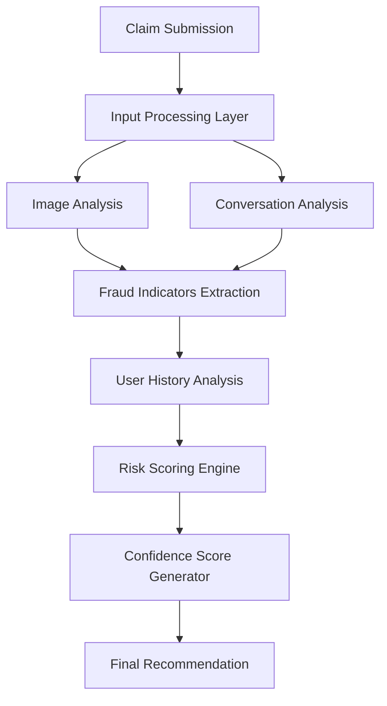

# 🛡️ AI Claim Verifier

**An AI-powered insurance claim validation system that flags potentially fraudulent claims before manual review.**
I built this project within 3 hours while participating in the HackerRank Orchestrate Hackathon JUN'26 


---

## 📌 Table of Contents

- [Overview](#-overview)
- [Why This Project](#-why-this-project)
- [Problem Statement](#-problem-statement)
- [Features](#-features)
- [System Architecture](#-system-architecture)
- [Tech Stack](#-tech-stack)
- [Project Modules](#-project-modules)
- [Risk Scoring Engine](#-risk-scoring-engine)
- [Sample Workflow](#-sample-workflow)
- [Project Structure](#-project-structure)
- [Installation](#-installation)
- [Usage](#-usage)
- [Future Improvements](#-future-improvements)
- [License](#-license)

---

## 🔎 Overview

**AI Claim Verifier** is an AI-powered insurance claim validation system designed to assist insurance companies in identifying potentially fraudulent claims before manual review.

The system analyzes multiple sources of information:

- 📝 Claim details
- 🖼️ Uploaded claim image
- 💬 Customer conversation history
- 📊 User claim history

Using these inputs, it generates:

- **Fraud Risk Score**
- **Confidence Score**
- **Approval Recommendation**
- **Manual Review Recommendation**

> The goal is not to replace human investigators, but to **prioritize suspicious claims** and **reduce fraudulent payouts**.

---

## 💡 Why This Project

Insurance companies process thousands of claims daily, and manual review struggles to keep up with challenges such as:

- Fake accident images
- Manipulated evidence
- Repeated fraudulent claim submissions
- Inconsistent customer statements
- Time-consuming manual verification

**This project aims to:**

✅ Automate initial claim screening
✅ Reduce fraud detection time
✅ Assist claim investigators
✅ Improve claim approval accuracy
✅ Lower operational costs

---

## ❓ Problem Statement

**Given:**
- Claim information
- Claim image
- Customer conversation
- Historical user data

**Determine whether the claim is:**
- ✅ Likely Genuine
- ⚠️ Suspicious
- 🚨 High Fraud Risk

...and generate a corresponding **confidence score**.

---

## ✨ Features

- 🧠 Multi-source fraud analysis (image + text + history)
- 📷 Image reliability checks (blur, duplication, missing evidence)
- 💬 Conversation consistency and contradiction detection
- 📈 Weighted, explainable risk-scoring engine
- 🎯 Clear, actionable recommendations (Approve / Manual Review / High Risk)
- 🔌 Modular design — each analysis module can be extended independently

---

## 🏗️ System Architecture



---

## 🛠️ Tech Stack

| Category | Tools |
|---|---|
| **Programming Language** | Python |
| **Data Processing** | Pandas, NumPy |
| **AI / NLP** | Scikit-learn, TF-IDF Vectorizer, Text Similarity Analysis |
| **Image Analysis** | OpenCV, PIL (Python Imaging Library) |
| **Visualization** | Matplotlib |
| **Dataset Handling** | CSV files |
| **Version Control** | Git, GitHub |

---

## 🧩 Project Modules

### 1️⃣ Claim Input Module
**Collects:** Claim Amount, Claim Description, User Information, Uploaded Image, Conversation Data
**Output:** Structured claim object

### 2️⃣ Image Analysis Module
**Purpose:** Analyze uploaded claim images
**Checks:** Missing image, blurry image, duplicate image, low-quality evidence
**Output:** Image Reliability Score

### 3️⃣ Conversation Analysis Module
**Purpose:** Analyze customer statements
**Checks:** Contradictions, repeated patterns, suspicious keywords, consistency of information
**Output:** Conversation Trust Score

### 4️⃣ User History Module
**Purpose:** Analyze previous claim behavior
**Checks:** Past claim count, rejected claims, manual review frequency, acceptance ratio
**Output:** Historical Risk Score

### 5️⃣ Risk Scoring Engine
Combines the outputs of all modules into a single **0–100 Fraud Risk Score**.

### 6️⃣ Recommendation Engine
Converts the risk score into a final, actionable recommendation.

---

## ⚖️ Risk Scoring Engine

The final fraud risk score is calculated using weighted contributions from each analysis module:

| Component | Weight |
|---|---|
| User History | 40% |
| Conversation Analysis | 30% |
| Image Analysis | 30% |

**Recommendation thresholds:**

| Risk Score Range | Recommendation |
|---|---|
| 0 – 30 | ✅ Approve |
| 31 – 60 | ⚠️ Manual Review |
| 61 – 100 | 🚨 High Fraud Risk |

---

## 🔄 Sample Workflow

**Input:**
- Claim Amount: ₹50,000
- Accident Image
- Description
- Conversation Transcript

**Processing Steps:**
1. Analyze Image
2. Analyze Conversation
3. Analyze User History
4. Calculate Risk Score
5. Generate Confidence Score
6. Return Recommendation

**Output:**
```
Fraud Risk Score: 72%
Confidence Score: 85%
Recommendation: High Fraud Risk
```

---

## 📁 Project Structure

```
ai-claim-verifier/
│
├── data/                      # Sample claim datasets (CSV)
├── modules/
│   ├── claim_input.py         # Claim Input Module
│   ├── image_analysis.py      # Image Analysis Module
│   ├── conversation_analysis.py  # Conversation Analysis Module
│   ├── user_history.py        # User History Module
│   ├── risk_engine.py         # Risk Scoring Engine
│   └── recommendation.py      # Recommendation Engine
│
├── notebooks/                 # Exploration & testing notebooks
├── outputs/                   # Generated reports / scores
├── requirements.txt
├── main.py                    # Entry point
└── README.md
```

---

## ⚙️ Installation

```bash
# Clone the repository
git clone https://github.com/<your-username>/ai-claim-verifier.git
cd ai-claim-verifier

# Create a virtual environment
python -m venv venv
source venv/bin/activate    # On Windows: venv\Scripts\activate

# Install dependencies
pip install -r requirements.txt
```

---

## ▶️ Usage

```bash
python main.py --claim_id 1024 --image path/to/claim_image.jpg --conversation path/to/transcript.txt
```

**Sample output:**
```
Fraud Risk Score: 72%
Confidence Score: 85%
Recommendation: High Fraud Risk
```

---

## 🚀 Future Improvements

- 🤖 Deep Learning–based fraud models
- ⚡ Real-time fraud detection
- 📄 OCR-based document verification
- 🧠 LLM-powered claim analysis
- ☁️ Cloud deployment
- 📊 Dashboard for investigators

---

## 📄 License

This project is licensed under the **MIT License**.

---

<div align="center">

**Built to make claim verification faster, smarter, and more reliable.**

</div>
